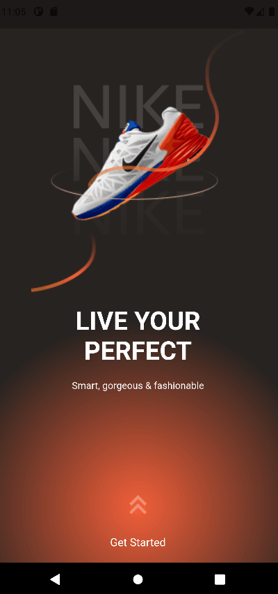

# Shoes Shopping App UI with 360 Rotation Image - Flutter Tutorial

Shoes Shopping App UI Tutorial App made with Flutter, with 360 Rotation Image.
Tutorial from @gilang.arinata "Nice Shoes Shopping App UI with 360 Rotation Image - Flutter E Commerce App Speed Code" [link](https://www.youtube.com/watch?v=BOUVUfo01CA&list=PL29yTdfAdnEfOHIWxgdb4j2ZmdLJJzE47&index=11).
The full video in my Youtube channel [link](https://youtube.com/shorts/qgezVTelpQA) and my Flutter Demos App video list [link](https://www.youtube.com/playlist?list=PL29yTdfAdnEfQ1U0hRkFxqD-ei2ux8-Hk)
- ListView.
- AnimationController.
- Tween Animation.
- AbsorbPointer.
- .map
- GridView.count.
- SingleChildScrollView.
- ImageView360.

##Graphical resource
- FlatIcon [link](https://www.flaticon.com/)
- PNGWing [link](https://www.pngwing.com/)

##Useful info: Change launch icon
- AppIcon [link](https://appicon.co/)
- Tutorial for change the Launch Icon [link](https://www.geeksforgeeks.org/flutter-changing-app-icon/)

## Getting Started

**Packages used:**
- community_material_icon: ^5.9.55 [link](https://pub.dev/packages/community_material_icon)
- page_transition: ^2.0.9 [link](https://pub.dev/packages/page_transition)
- imageview360: ^1.3.0 [link](https://pub.dev/packages/imageview360)

## GIF

## Screenshots

